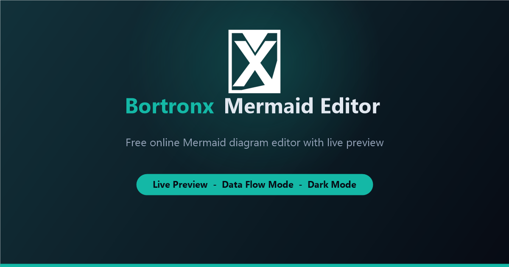
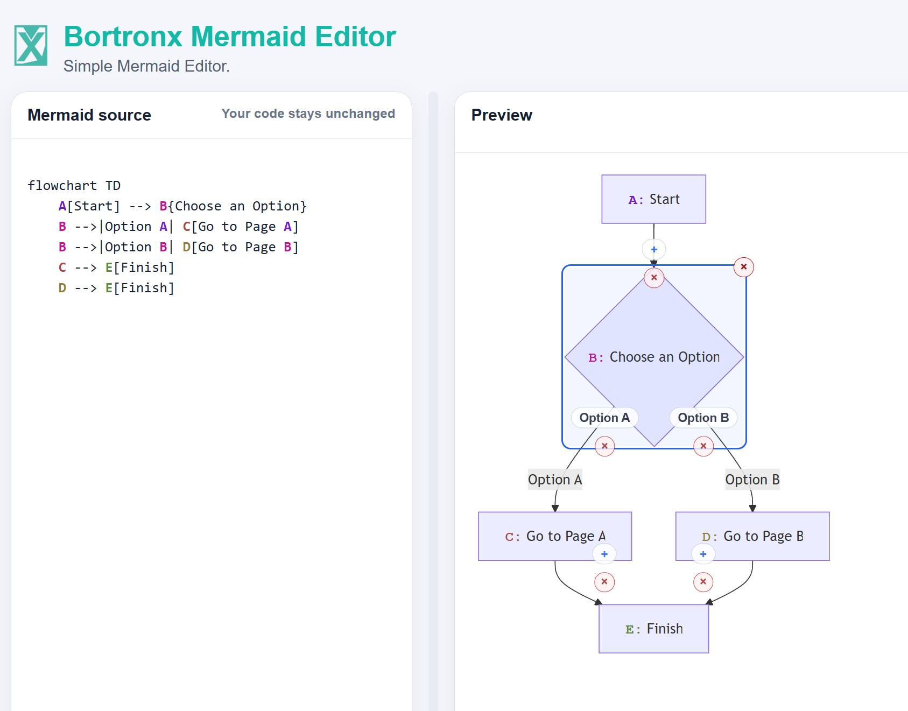

# Bortronx Mermaid Editor




Bortronx Mermaid Editor is a Blazor-based Mermaid diagram editor with a live preview pane and a focused workflow for building standard Mermaid diagrams or data flow diagrams.

The repository contains:

- `Libraries/BortronxMermaidEditor`: a reusable Razor Class Library component.
- `src`: a Blazor WebAssembly app that hosts the editor.
- `Firebase/public`: the published static output, including the generated social preview image.
- `Desktop`: an optional, fully offline desktop wrapper (Windows and Linux).

## Features



- Live Mermaid source editing with immediate preview updates.
- Standard mode and Data Flow Diagram mode.
- Data flow helpers for entities, processes, data stores, flows, and legend management.
- Interactive preview controls including zoom, fullscreen, and diagram editing helpers.
- Undo and redo support.
- Light and dark theme toggle.
- Error console for Mermaid parsing issues.
- 

## Run locally

```bash
dotnet run --project src/BlazorMermaidEditor.csproj
```

## Use the component

Add a project or package reference to `BortronxMermaidEditor`, then render the component in a Razor page:

```razor
<MermaidEditor />
```

## Desktop app (offline)

The editor is also available as a standalone desktop app that runs **fully offline** — it
bundles the published web app and serves it locally, so no internet connection is required.

### Download

Grab the latest build from the [Releases page](https://github.com/Bortronx/BortronxMermaidEditor/releases):

- **Windows:** download `BortronxMermaidEditor-win-x64.exe` and double-click to run. No
  installation needed. On the first launch Windows SmartScreen may show a warning for the
  unsigned app — choose **More info → Run anyway**.
- **Linux:** download `BortronxMermaidEditor-linux-x64`, then:

  ```bash
  chmod +x BortronxMermaidEditor-linux-x64
  ./BortronxMermaidEditor-linux-x64
  ```

  Requires WebKitGTK (`libwebkit2gtk-4.1` / `4.0`), which ships with most desktop Linux
  distributions or installs from your package manager.

### Build locally

The desktop project lives entirely in `Desktop/` and is isolated from the web app — it only
consumes the web app's published output. To build it, publish the web app, copy its `wwwroot`
into `Desktop/wwwroot`, then publish the desktop app for your platform:

```bash
# 1) Publish the web app
dotnet publish src/BlazorMermaidEditor.csproj -c Release -o publish-web

# 2) Copy the published web output into the desktop bundle folder
#    Windows (PowerShell):
#      Remove-Item Desktop/wwwroot -Recurse -Force -ErrorAction SilentlyContinue
#      Copy-Item publish-web/wwwroot/* Desktop/wwwroot -Recurse -Force
#    Linux/macOS:
#      rm -rf Desktop/wwwroot && mkdir -p Desktop/wwwroot && cp -r publish-web/wwwroot/. Desktop/wwwroot/

# 3) Publish the self-contained desktop binary (use win-x64 or linux-x64)
dotnet publish Desktop/BortronxMermaidEditor.Desktop.csproj -c Release -r win-x64 -o publish-desktop
```

Releases are produced automatically by the `Release Desktop App` GitHub Actions workflow when
a version tag (for example `v1.0.0`) is pushed.

## License

This project is licensed under the MIT License. See [LICENSE](LICENSE).
